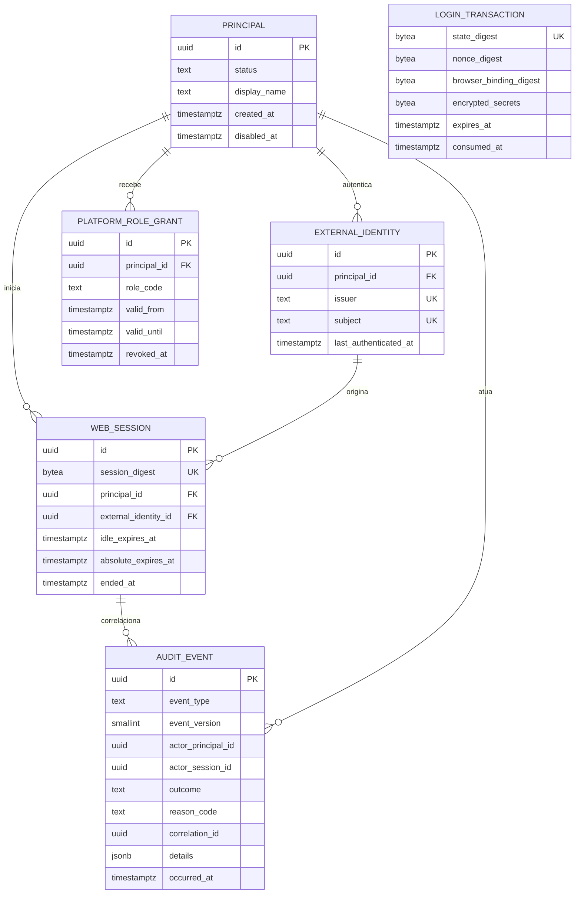

# Fundação de identidade da primeira fatia

Este documento registra o modelo efetivamente necessário para a issue #3. Ele detalha a aplicação das ADRs 0002 e 0003 sem antecipar conceitos de universidade ou do domínio acadêmico.

## Limite do modelo

A primeira migration contém seis conceitos do produto e a estrutura técnica de controle de migrations:



`LOGIN_TRANSACTION` não se relaciona a uma pessoa: ela existe antes da autenticação terminar e é localizada apenas pelo resumo do `state`. Os nomes físicos e campos auxiliares permanecem definidos pela migration; o diagrama mostra as invariantes, não um contrato de API pública.

Ficam explicitamente fora desta migration: tenant, instituição, pessoa institucional, vínculo, aluno, servidor, unidade, curso, currículo, componente, turma e matrícula. Esses conceitos entram somente quando uma jornada aprovada precisar deles.

## Invariantes

- Somente o par exato e case-sensitive `(issuer, subject)` localiza uma identidade externa.
- Nome, username, e-mail e CPF não localizam, unem ou promovem contas.
- Uma identidade externa pertence a um único principal; o modelo permite mais de uma identidade por principal no futuro.
- Uma sessão contém apenas uma referência ao principal. Papéis e capacidades são reavaliados no estado atual do banco.
- A concessão `platform_operator` fornece somente `platform.access` e `platform.audit.read` nesta fatia.
- Toda requisição protegida revalida o principal e a concessão vigente. Se a
  concessão desaparecer, a mesma transação encerra a sessão e grava os eventos
  `security.session_ended` e `security.access_denied`; o cookie é removido na
  resposta.
- Transações de login expiram em cinco minutos, são vinculadas ao navegador e consumidas uma única vez.
- O início de login aceita no máximo 12 solicitações por cliente e 300 no total
  por minuto em cada processo da API. O mapa de clientes é limitado; esse
  controle local não substitui um limitador distribuído de produção.
- Sessões expiram após trinta minutos de inatividade ou oito horas absolutas, o que ocorrer primeiro.
- O banco armazena somente resumos dos valores de cookie. `state`, `nonce` e o verificador PKCE recebem proteção adequada ao uso posterior.
- Cookies de sessão não são persistentes, são `HttpOnly` e `SameSite=Lax`; fora
  do modo local também são `Secure` e usam o prefixo `__Host-`.
- Eventos funcionais são estruturados, minimizados e append-only para a credencial de runtime.
- Criação, expiração, revogação e encerramento de sessão não são confirmados se o
  evento de auditoria que integra a mesma transação não puder ser persistido.

## Fronteiras de credenciais

O ambiente local compartilha uma instância PostgreSQL, mas não um banco ou usuário:

| Credencial | Pode | Não pode |
| --- | --- | --- |
| Keycloak | operar somente o banco `keycloak` | conectar ao banco `lice` |
| `lice_migrator` | aplicar migrations e executar bootstrap administrativo explícito | ser usada pela API em execução |
| `lice_runtime` | operar login e sessões, consultar identidade/concessão e inserir/ler auditoria | alterar schema, criar concessões ou atualizar, apagar e truncar auditoria |

Uma negação ou expiração é registrada em transação curta própria. Criação, encerramento ou expiração de sessão e seu evento semântico são atômicos.

## Contrato HTTP inicial

```text
GET  /health/live
GET  /health/ready
GET  /api/v1/auth/login
GET  /api/v1/auth/callback
GET  /api/v1/session
POST /api/v1/auth/logout
GET  /api/v1/platform/audit-events
GET  /api/v1/platform/audit-events/{event_id}
```

A API Go é o cliente OIDC confidencial e o único backend da interface. Conteúdo autorizado só é solicitado depois de a sessão ser validada; respostas de sessão, callback e auditoria não podem ser armazenadas em cache.

Respostas protegidas informam a nova expiração por inatividade em
`X-Lice-Session-Idle-Expires-At`. A interface limita seu temporizador pelo prazo
absoluto da sessão e revalida o acesso ao recuperar foco, visibilidade ou uma
página preservada pelo histórico do navegador.

As jornadas visíveis desta fatia estão em `/entrar`, `/controle`,
`/controle/auditoria` e `/controle/auditoria/{event_id}`. Negação, fluxo inválido,
sessão expirada e indisponibilidade possuem páginas próprias sem refletir
detalhes internos.

## Limite de implantação

A composição versionada demonstra as invariantes acima somente em ambiente
local, com HTTP, Keycloak em `start-dev`, segredos sintéticos e uma única
instância de cada processo. A configuração `production` rejeita URL pública sem
HTTPS e ativa cookies seguros, mas não representa uma oferta pronta para dados
reais.

Uma implantação institucional ainda exige uma topologia de produção do IdP,
MFA conforme política, TLS e controles de borda, armazenamento e rotação de
segredos, backups e restauração testados, alta disponibilidade, observabilidade,
retenção de auditoria, resposta a incidentes e avaliação de segurança. Nesta
fatia também não existe plano de dados de tenant nem tratamento de PII
acadêmica.

## Decisões adiadas

- qualquer modelo de tenant ou pessoa;
- catálogo editável de capacidades;
- vinculação self-service de identidades;
- refresh token, back-channel logout e sessões de clientes não web;
- retenção, exportação e proteção criptográfica avançada da auditoria;
- particionamento e limpeza periódica de sessões e auditoria. Transações de
  login consumidas ou expiradas recebem apenas remoção oportunista e limitada
  quando uma nova transação é criada.
